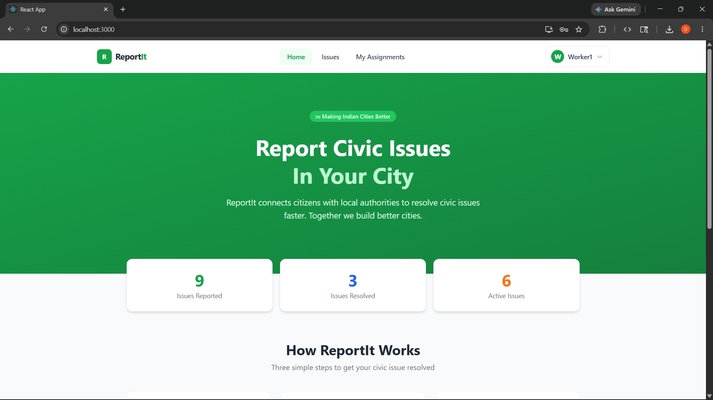
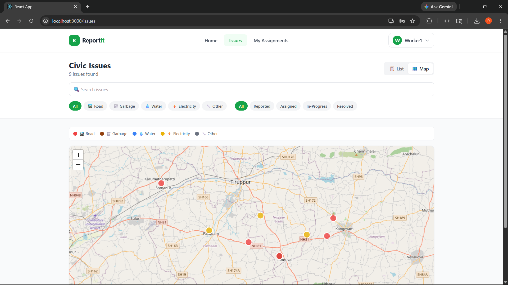
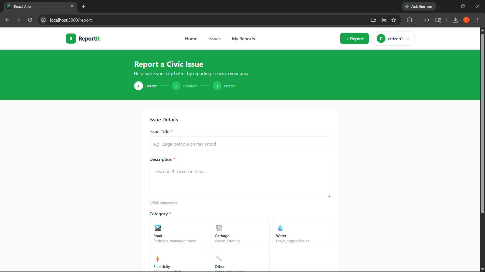
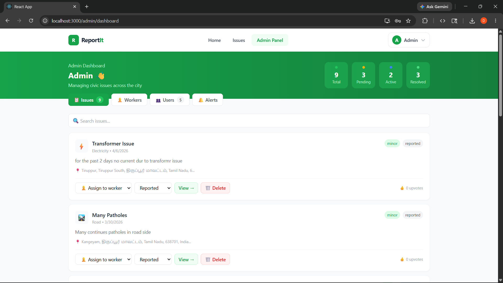
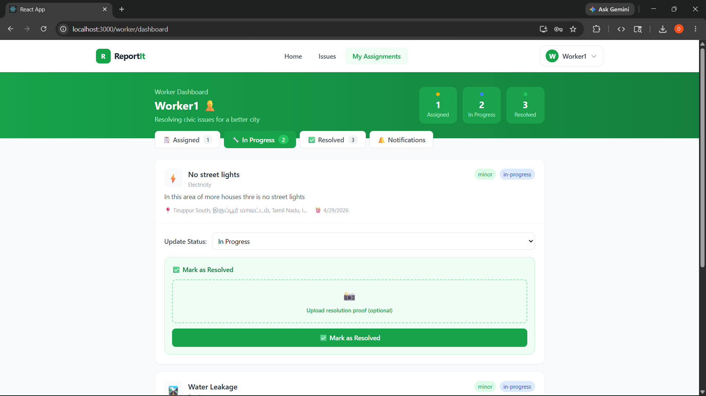
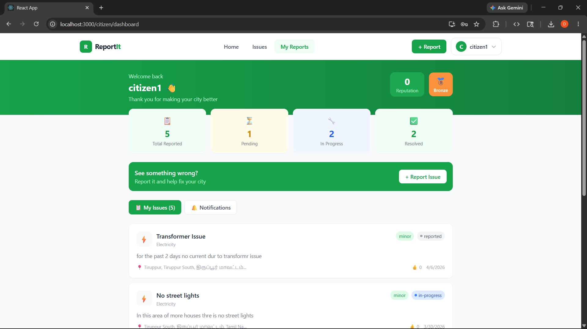

# ReportIt 📍
### Crowdsourced Civic Issue Reporting and Resolution System

> A full-stack MERN application that empowers citizens to report civic issues, track resolution progress in real-time, and hold local authorities accountable.

---


## 📸 Screenshots

| Home Page | Issues Map | Report Issue |
|-----------|-----------|-------------|
|  |  |  |

| Admin Dashboard | Worker Dashboard | Citizen Dashboard |
|----------------|-----------------|------------------|
|  |  |  |

---

## ✨ Features

### 👤 Citizen
- 📸 Report issues with photo upload + GPS location
- 🗺️ Interactive map picker for exact location
- 👍 Upvote issues to increase priority
- 🔔 Real-time notifications when issues are updated
- 🕵️ Anonymous reporting option
- 📊 Personal dashboard with issue tracking
- 🏅 Reputation score + badge system

### 👷 Municipality Worker
- 📋 View all assigned issues
- 🔧 Update issue status in real-time
- ✅ Upload resolution proof photos
- 🔔 Real-time notifications when assigned

### 🔑 Admin
- 📊 Full analytics dashboard
- 👷 Approve/reject worker registrations
- 📌 Assign issues to workers
- 🗺️ Issue heatmap view
- ⚠️ Auto-escalation alerts
- 🗑️ Delete and manage all issues

### ⚙️ System Features
- ⚡ Real-time updates via Socket.io
- ⏰ Auto-escalation of overdue issues (node-cron)
- 🔐 JWT role-based authentication
- 🖼️ Cloudinary image storage
- 🗺️ Leaflet.js interactive maps
- 📱 Responsive design

---

## 🛠️ Tech Stack

### Frontend
| Technology | Purpose |
|-----------|---------|
| React.js | UI Framework |
| Tailwind CSS | Styling |
| Leaflet.js | Interactive Maps |
| Socket.io-client | Real-time Updates |
| Axios | API Calls |
| React Router v6 | Navigation |

### Backend
| Technology | Purpose |
|-----------|---------|
| Node.js | Runtime |
| Express.js | Web Framework |
| Socket.io | Real-time Communication |
| Mongoose | MongoDB ODM |
| JWT | Authentication |
| Bcryptjs | Password Hashing |
| Multer | File Upload |
| node-cron | Auto Escalation |
| Cloudinary | Image Storage |

### Database
| Technology | Purpose |
|-----------|---------|
| MongoDB Atlas | Database |

---

## 🚀 Getting Started

### Prerequisites
```bash
Node.js >= 18
MongoDB Atlas account
Cloudinary account
```

### Installation

**1. Clone the repository**
```bash
git clone https://github.com/dharu-dharanic/ReportIt.git
cd ReportIt
```

**2. Setup Backend**
```bash
cd server
npm install
```

**3. Create `.env` file in server folder**
```env
PORT=5000
MONGO_URI=your_mongodb_connection_string
JWT_SECRET=your_jwt_secret
CLOUDINARY_CLOUD_NAME=your_cloud_name
CLOUDINARY_API_KEY=your_api_key
CLOUDINARY_API_SECRET=your_api_secret
```

**4. Setup Frontend**
```bash
cd client
npm install --legacy-peer-deps
```

**5. Run Development Servers**

Backend:
```bash
cd server
npm run dev
```

Frontend:
```bash
cd client
npm start
```

**6. Create Admin Account**

Go to MongoDB Atlas → Browse Collections → users → Insert Document:
```json
{
  "name": "Admin",
  "email": "admin@reportit.com",
  "password": "$2a$10$92IXUNpkjO0rOQ5byMi.Ye4oKoEa3Ro9llC/.og/at2.uheWG/igi",
  "role": "admin",
  "status": "active",
  "reputationScore": 0,
  "badge": "bronze"
}
```
> Default password: `password`

---

## 📁 Project Structure

```
ReportIt/
├── client/                    # React Frontend
│   ├── public/
│   └── src/
│       ├── components/        # Reusable components
│       │   └── Navbar.js
│       ├── context/           # Global state
│       │   └── AuthContext.js
│       ├── hooks/             # Custom hooks
│       │   └── useSocket.js
│       ├── pages/             # Page components
│       │   ├── Home.js
│       │   ├── Issues.js
│       │   ├── IssueDetail.js
│       │   ├── ReportIssue.js
│       │   ├── Login.js
│       │   ├── Register.js
│       │   ├── AdminDashboard.js
│       │   ├── WorkerDashboard.js
│       │   ├── CitizenDashboard.js
│       │   ├── Pending.js
│       │   └── NotFound.js
│       └── services/          # API calls
│           └── api.js
│
└── server/                    # Node.js Backend
    ├── config/
    │   └── cloudinary.js
    ├── controllers/
    │   ├── authController.js
    │   └── issueController.js
    ├── middleware/
    │   ├── auth.js
    │   └── role.js
    ├── models/
    │   ├── User.js
    │   ├── Issue.js
    │   └── Notification.js
    ├── routes/
    │   ├── authRoutes.js
    │   └── issueRoutes.js
    ├── services/
    │   └── escalationService.js
    ├── db.js
    └── index.js
```

---

## 🔄 User Flow

```
Citizen                    Admin                    Worker
  │                          │                        │
  ├─ Register                ├─ Login                 ├─ Register (pending)
  ├─ Report Issue            ├─ View all issues        │
  ├─ Add GPS location        ├─ Assign to worker  ────►├─ Get notified
  ├─ Upload photos           ├─ Approve workers        ├─ Update status
  ├─ Track status            ├─ View analytics         ├─ Upload proof
  ├─ Get notifications       ├─ Get escalation alerts  ├─ Mark resolved
  └─ Upvote issues           └─ Manage users      ────►└─ Citizen notified
```

---

## 🔌 API Endpoints

### Auth Routes
| Method | Endpoint | Description | Access |
|--------|---------|-------------|--------|
| POST | `/api/auth/register` | Register user | Public |
| POST | `/api/auth/login` | Login user | Public |
| GET | `/api/auth/pending-workers` | Get pending workers | Admin |
| GET | `/api/auth/users` | Get all users | Admin |
| PUT | `/api/auth/approve/:id` | Approve worker | Admin |
| PUT | `/api/auth/reject/:id` | Reject worker | Admin |

### Issue Routes
| Method | Endpoint | Description | Access |
|--------|---------|-------------|--------|
| POST | `/api/issues` | Create issue | Citizen |
| GET | `/api/issues` | Get all issues | Public |
| GET | `/api/issues/:id` | Get single issue | Public |
| PUT | `/api/issues/:id/status` | Update status | Worker/Admin |
| PUT | `/api/issues/:id/upvote` | Upvote issue | Citizen |
| PUT | `/api/issues/:id/assign` | Assign to worker | Admin |
| PUT | `/api/issues/:id/resolve` | Upload resolution | Worker |
| DELETE | `/api/issues/:id` | Delete issue | Admin |

---

## ⚡ Real-Time Events (Socket.io)

| Event | Direction | Description |
|-------|-----------|-------------|
| `newIssue` | Server → Client | New issue reported |
| `issueStatusChanged` | Server → Client | Status updated |
| `issueUpvoted` | Server → Client | Issue upvoted |
| `issueDeleted` | Server → Client | Issue deleted |
| `issueAssigned` | Server → Worker | Issue assigned |
| `issueUpdated` | Server → Citizen | Issue updated |
| `issueResolved` | Server → Citizen | Issue resolved |
| `issueEscalated` | Server → Admin | Issue escalated |

---

## 🚀 Deployment

### Backend — Render
1. Push code to GitHub
2. Create new Web Service on Render
3. Connect GitHub repository
4. Set environment variables
5. Deploy

### Frontend — Vercel
1. Push code to GitHub
2. Import project on Vercel
3. Set build command: `npm run build`
4. Set output directory: `build`
5. Deploy

---

## 🤝 Contributing

1. Fork the repository
2. Create your feature branch (`git checkout -b feature/AmazingFeature`)
3. Commit your changes (`git commit -m 'feat: Add AmazingFeature'`)
4. Push to the branch (`git push origin feature/AmazingFeature`)
5. Open a Pull Request

---

## 📝 License

This project is licensed under the MIT License.

---

## 👨‍💻 Author

**Your Name**
- GitHub: [@dharu-dharanic](https://github.com/dharu-dharanic)

---

<div align="center">
  <p>Made with ❤️ for better Indian cities</p>
  <p>⭐ Star this repo if you found it helpful!</p>
</div>